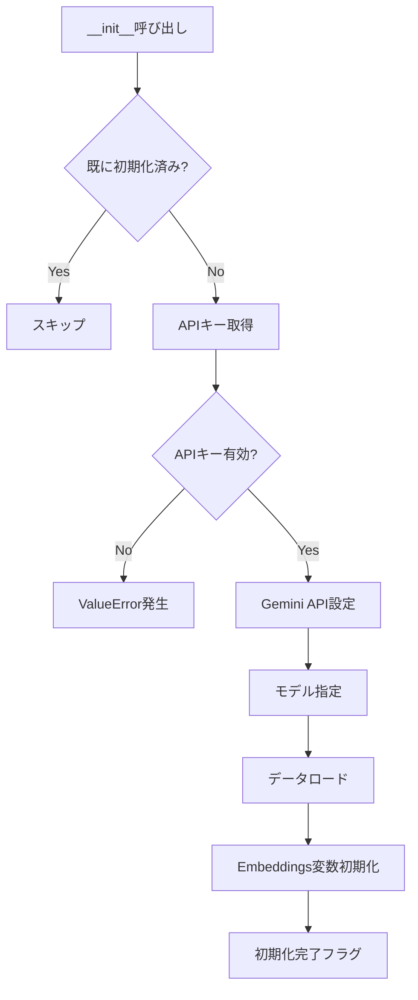
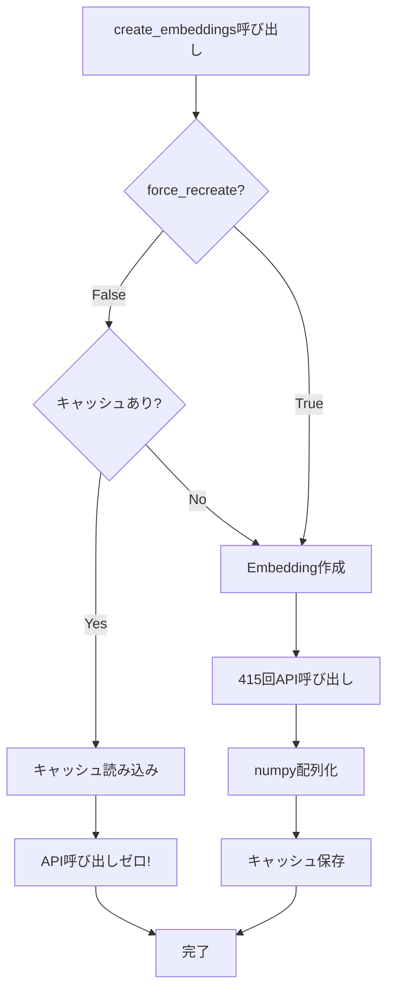
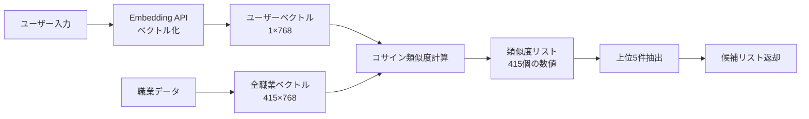
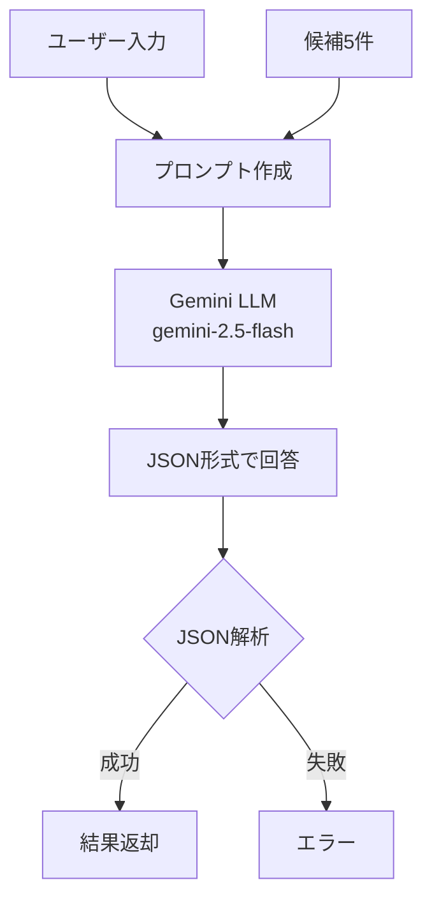

# classifier.py 完全解説ドキュメント

## 📄 概要

`classifier.py`は職業分類判定システムの**核心部分**で、RAG（Retrieval-Augmented Generation）アーキテクチャを実装しています。

**ファイル情報:**
- パス: `backend/app/classifier.py`
- 行数: 365行
- 主要クラス: `OccupationClassifier`
- 依存関係: Gemini API, pandas, numpy, scikit-learn

---

## 🏗️ クラス構造

### OccupationClassifier クラス

```python
class OccupationClassifier:
    """
    職業分類判定クラス（RAGシステムの実装）
    
    特徴:
    - シングルトンパターン（インスタンスは1つだけ）
    - Gemini Embedding API で意味的検索
    - Gemini Generative API で最終判定
    - Embeddingキャッシュで高速化
    """
```

**主要な属性:**
```python
self.api_key            # Gemini APIキー
self.embedding_model    # "models/text-embedding-004"
self.llm_model          # "models/gemini-2.5-flash"
self.model              # GenerativeModelインスタンス
self.data               # 職業データ（DataFrame）
self.embeddings         # 職業データのEmbedding（numpy配列）
self.embedding_texts    # Embedding対象のテキストリスト
```

---

## 📋 メソッド詳細

### 1. `__new__` - シングルトンパターン実装

**コード:**
```python
_instance = None

def __new__(cls, *args, **kwargs):
    """シングルトンパターン実装"""
    if cls._instance is None:
        cls._instance = super().__new__(cls)
    return cls._instance
```

**目的:**
- アプリケーション全体で1つのインスタンスのみを使用
- メモリ効率化（415件のEmbeddingを1回だけ保持）

**動作:**
```python
# 複数回インスタンス化しても同じオブジェクトを返す
classifier1 = OccupationClassifier()  # 新規作成
classifier2 = OccupationClassifier()  # 同じインスタンス
print(classifier1 is classifier2)      # True
```

**なぜ必要？**
- FastAPIは複数のワーカープロセスを起動する可能性がある
- 各リクエストで新しいインスタンスを作成すると、メモリとAPI呼び出しが無駄
- 1つのインスタンスを共有することで効率化

---

### 2. `__init__` - 初期化処理

**シグネチャ:**
```python
def __init__(self, csv_path: str = None, api_key: str = None):
```

**パラメータ:**
| パラメータ | 型 | デフォルト | 説明 |
|-----------|-----|-----------|------|
| `csv_path` | str | None | 職業データCSVのパス |
| `api_key` | str | None | Gemini APIキー |

**処理フロー:**



**詳細コード解説:**

```python
# 1. 既存インスタンス再利用時のスキップ
if hasattr(self, '_initialized'):
    return  # 2回目以降は何もしない

# 2. APIキー取得（優先順位: 引数 > 環境変数）
self.api_key = api_key or os.getenv("GEMINI_API_KEY")

# 3. APIキー検証
if not self.api_key or self.api_key == "your_gemini_api_key_here":
    raise ValueError("GEMINI_API_KEYが設定されていません。")

# 4. Gemini API設定
genai.configure(api_key=self.api_key)

# 5. モデル指定
self.embedding_model = "models/text-embedding-004"  # ベクトル化用
self.llm_model = "models/gemini-2.5-flash"          # 推論用

# 6. GenerativeModelインスタンス作成
self.model = genai.GenerativeModel(self.llm_model)

# 7. データロード
self.data = self._load_data(csv_path)

# 8. Embeddings（遅延評価 - 後で作成）
self.embeddings = None
self.embedding_texts = None

# 9. 初期化完了
self._initialized = True
print(f"OccupationClassifier initialized with {len(self.data)} occupations")
```

---

### 3. `_load_data` - データ読み込み

**シグネチャ:**
```python
def _load_data(self, csv_path: str = None) -> pd.DataFrame:
```

**処理フロー:**

```python
def _load_data(self, csv_path: str = None):
    """
    データ読み込み（優先順位付き）
    
    1. csv_pathが指定 & ファイル存在 → CSVから読み込み（実データ）
    2. それ以外 → ダミーデータ作成（16職業）
    """
    
    # ケース1: CSVファイルから読み込み
    if csv_path and os.path.exists(csv_path):
        print(f"CSVファイルを読み込んでいます: {csv_path}")
        return pd.read_csv(csv_path)
    
    # ケース2: ダミーデータ作成（フォールバック）
    else:
        print("ダミーデータを使用しています...")
        dummy_data = [
            # 16職業のハードコードデータ
            {...}, {...}, ...
        ]
        return pd.DataFrame(dummy_data)
```

**ダミーデータの詳細:**

ダミーデータは**16職業**で構成されています：

| コード | 職業名 | 説明 |
|-------|-------|------|
| 11 | 管理的職業従事者 | 会社役員、企業の部課長... |
| 21 | 一般事務従事者 | 庶務、人事、経理... |
| 25 | 会計事務従事者 | 経理担当者、会計係... |
| 32 | 保安職業従事者 | 自衛官、警察官、消防士... |
| 35 | 介護サービス職業従事者 | 介護福祉士、ヘルパー... |
| 41 | 販売従事者 | 小売店員、営業職... |
| 52 | 飲食物調理従事者 | 調理師、コック... |
| 61 | 農林漁業従事者 | 農家、漁師... |
| 71 | 製造・加工処理従事者 | 工場作業員... |
| 81 | 建設・採掘従事者 | 大工、建築作業員... |
| 91 | 運搬・清掃・包装等従事者 | トラック運転手... |
| 12 | 情報処理・通信技術者 | SE、プログラマー... |
| 14 | 建築・土木・測量技術者 | 建築士、土木技術者... |
| 15 | 医師・歯科医師・獣医師・薬剤師 | 医師、歯科医... |
| 16 | 保健師・助産師・看護師 | 看護師、保健師... |
| 17 | 教員 | 小学校教員、中学校教員... |

**ダミーデータの役割:**

1. **開発・テスト環境**: CSVファイルなしで動作確認
2. **デモ用**: API制限があってもデモ実行可能
3. **フォールバック**: データファイルが見つからない場合の保険

**現在の運用状態:**

```python
# main.py での呼び出し
classifier = OccupationClassifier(csv_path="data/occupation.csv")

結果:
→ CSVファイルが存在: ✅
→ 実データ415件を読み込み
→ ダミーデータは使用しない
```

---

### 4. `create_embeddings` - Embedding作成（キャッシュ機能付き）

**シグネチャ:**
```python
def create_embeddings(self, force_recreate: bool = False):
```

**パラメータ:**
| パラメータ | 型 | デフォルト | 説明 |
|-----------|-----|-----------|------|
| `force_recreate` | bool | False | キャッシュを無視して再作成 |

**処理フロー:**



**詳細コード:**

```python
def create_embeddings(self, force_recreate: bool = False):
    cache_file = "data/embeddings_cache.npy"
    
    # ステップ1: キャッシュから読み込み（高速化）
    if not force_recreate and os.path.exists(cache_file):
        try:
            print(f"キャッシュからEmbeddingsを読み込んでいます: {cache_file}")
            self.embeddings = np.load(cache_file)
            
            # embedding_textsも再構築
            self.embedding_texts = (
                self.data['name'] + '。' + self.data['description']
            ).tolist()
            
            print(f"Embeddingsキャッシュ読み込み完了 (shape: {self.embeddings.shape})")
            print(f"💡 API呼び出しを節約しました！（{len(self.data)}件のEmbedding作成をスキップ）")
            return
            
        except Exception as e:
            print(f"⚠️ キャッシュ読み込み失敗: {e}")
            print("新しくEmbeddingsを作成します...")
    
    # ステップ2: 既に作成済みかチェック
    if self.embeddings is not None:
        print("Embeddingsは既に作成済みです")
        return
    
    # ステップ3: Embedding作成（時間がかかる）
    print(f"Embeddingsを作成しています...（{len(self.data)}件）")
    print("⚠️ 初回のみ時間がかかります。次回からはキャッシュを使用します。")
    
    # テキスト結合: "職業名。説明文"
    self.embedding_texts = (
        self.data['name'] + '。' + self.data['description']
    ).tolist()
    
    # Gemini Embedding API呼び出し
    embeddings_list = []
    for i, text in enumerate(self.embedding_texts):
        if (i + 1) % 50 == 0:
            print(f"  進捗: {i + 1}/{len(self.embedding_texts)}")
        
        try:
            result = genai.embed_content(
                model=self.embedding_model,  # "models/text-embedding-004"
                content=text
            )
            embeddings_list.append(result['embedding'])
        except Exception as e:
            print(f"  エラー (職業 {i}): {e}")
            raise
    
    # numpy配列に変換
    self.embeddings = np.array(embeddings_list)
    print(f"Embeddings作成完了 (shape: {self.embeddings.shape})")
    
    # ステップ4: キャッシュに保存
    try:
        os.makedirs(os.path.dirname(cache_file), exist_ok=True)
        np.save(cache_file, self.embeddings)
        print(f"✅ Embeddingsをキャッシュに保存しました: {cache_file}")
        print(f"💡 次回起動時はAPI呼び出しなしで高速起動できます！")
    except Exception as e:
        print(f"⚠️ キャッシュ保存失敗（無視して続行）: {e}")
```

**キャッシュファイル:**
- パス: `data/embeddings_cache.npy`
- フォーマット: NumPy binary format
- サイズ: 約1.3MB（415 × 768 × 4bytes）

**API呼び出しの削減効果:**

| シナリオ | API呼び出し数 |
|---------|-------------|
| 初回起動（キャッシュなし） | 415回 |
| 2回目以降（キャッシュあり） | **0回** 🎉 |

---

### 5. `search_candidates` - 類似職業検索

**シグネチャ:**
```python
def search_candidates(self, user_input: str, top_k: int = 5) -> List[Dict]:
```

**パラメータ:**
| パラメータ | 型 | デフォルト | 説明 |
|-----------|-----|-----------|------|
| `user_input` | str | - | ユーザーの自由記述入力 |
| `top_k` | int | 5 | 取得する候補数 |

**戻り値:**
```python
[
    {
        "code": "452",
        "name": "消防員",
        "description": "火災の予防・警戒・鎮圧...",
        "similarity": 0.85
    },
    {...},  # Top-5
]
```

**処理フロー:**



**詳細コード:**

```python
def search_candidates(self, user_input: str, top_k: int = 5):
    # Embeddingsが未作成なら作成
    if self.embeddings is None:
        self.create_embeddings()
    
    try:
        # ステップ1: ユーザー入力をベクトル化
        result = genai.embed_content(
            model=self.embedding_model,
            content=user_input,
            task_type="retrieval_query"  # 検索クエリ用
        )
        user_embedding = np.array([result['embedding']])
        # 形状: (1, 768)
        
        # ステップ2: コサイン類似度を計算
        similarities = cosine_similarity(
            user_embedding,      # (1, 768)
            self.embeddings      # (415, 768)
        )[0]
        # 結果: [0.85, 0.72, 0.68, ..., 0.23]  # 415個の類似度
        
        # ステップ3: 類似度順にソート（降順）
        top_indices = np.argsort(similarities)[::-1][:top_k]
        # 結果: [234, 412, 89, 156, 23]  # Top-5のインデックス
        
        # ステップ4: 候補リストを作成
        candidates = []
        for idx in top_indices:
            candidates.append({
                "code": self.data.iloc[idx]["code"],
                "name": self.data.iloc[idx]["name"],
                "description": self.data.iloc[idx]["description"],
                "similarity": float(similarities[idx])
            })
        
        return candidates
        
    except Exception as e:
        raise RuntimeError(f"候補検索中にエラーが発生しました: {str(e)}")
```

**コサイン類似度の計算方法:**

```python
from sklearn.metrics.pairwise import cosine_similarity

# 2つのベクトルの方向の近さを-1〜1で表現
# 1.0  : 完全に同じ方向（最も類似）
# 0.0  : 直角（無関係）
# -1.0 : 正反対の方向

similarity = cosine_similarity(
    [[0.1, 0.2, 0.3]],  # ベクトルA
    [[0.1, 0.2, 0.3]]   # ベクトルB
)
# 結果: [[1.0]]  ← 完全一致
```

---

### 6. `decide_class` - LLMによる最終判定

**シグネチャ:**
```python
def decide_class(self, user_input: str, candidates: List[Dict]) -> Dict:
```

**パラメータ:**
| パラメータ | 型 | 説明 |
|-----------|-----|------|
| `user_input` | str | ユーザーの自由記述入力 |
| `candidates` | List[Dict] | 検索された候補リスト（Top-5） |

**戻り値:**
```python
{
    "code": "452",
    "name": "消防員",
    "reason": "「消防車に乗って火を消す」という記述が、消防員の主要業務である消火活動に直接該当するため。"
}
```

**処理フロー:**



**プロンプト例:**

```python
"""
あなたは職業分類の専門家です。
ユーザーの入力と、候補となる職業分類リストを比較し、
最も適切な職業分類を1つ選択してください。

【ユーザーの入力】
消防車に乗って火を消す仕事

【候補となる職業分類】
- コード: 452, 名称: 消防員, 説明: 火災の予防・警戒・鎮圧、洪水・火事・地震などによる被害の軽減などの仕事...
- コード: 451, 名称: 警察官, 説明: 治安維持、犯罪の予防・捜査...
- コード: 450, 名称: 自衛官, 説明: 国の防衛、災害派遣...
- コード: I42, 名称: 自動車運転従事者, 説明: タクシー運転手、バス運転手...
- コード: E52, 名称: 飲食物調理従事者, 説明: 調理師、コック...

上記の候補から最も適切な職業分類を1つ選択し、
必ず以下のJSON形式で回答してください：
{
  "code": "職業コード",
  "name": "職業名",
  "reason": "この職業を選択した理由（日本語で簡潔に）"
}
"""
```

**詳細コード:**

```python
def decide_class(self, user_input: str, candidates: List[Dict]):
    # プロンプト作成
    candidates_text = "\\n".join([
        f"- コード: {c['code']}, 名称: {c['name']}, 説明: {c['description']}"
        for c in candidates
    ])
    
    prompt = f"""あなたは職業分類の専門家です。
ユーザーの入力と、候補となる職業分類リストを比較し、最も適切な職業分類を1つ選択してください。

【ユーザーの入力】
{user_input}

【候補となる職業分類】
{candidates_text}

上記の候補から最も適切な職業分類を1つ選択し、必ず以下のJSON形式で回答してください：
{{
  "code": "職業コード",
  "name": "職業名",
  "reason": "この職業を選択した理由（日本語で簡潔に）"
}}"""
    
    try:
        # Gemini LLMで判定
        response = self.model.generate_content(
            prompt,
            generation_config=genai.GenerationConfig(
                response_mime_type="application/json",  # JSON形式強制
                temperature=0.3  # 創造性を抑え、決定論的に
            )
        )
        
        # JSON解析
        result = json.loads(response.text)
        return result
        
    except Exception as e:
        raise RuntimeError(f"Gemini での判定中にエラーが発生しました: {str(e)}")
```

**JSON Modeの利点:**
- LLMが必ずJSON形式で回答
- パース エラーを減らせる
- 構造化されたデータ取得が確実

---

### 7. `classify` - メイン処理（RAGの実装）

**シグネチャ:**
```python
def classify(self, user_input: str) -> Dict:
```

**これがRAGの核心！**

```python
def classify(self, user_input: str) -> Dict:
    """
    職業分類判定のメイン処理（RAG実装）
    
    RAG = Retrieval + Augmented + Generation
    """
    
    # Step 1: Retrieval（検索）
    # - ユーザー入力をベクトル化
    # - 415件からTop-5を検索
    candidates = self.search_candidates(user_input, top_k=5)
    
    # Step 2: Augmented Generation（拡張生成）
    # - 検索結果（Top-5）をプロンプトに含める
    # - LLMが文脈を理解して最終判定
    result = self.decide_class(user_input, candidates)
    
    # 結果に候補リストとユーザー入力を追加
    result['candidates'] = candidates
    result['user_input'] = user_input
    
    return result
```

**RAGの利点:**

| アプローチ | 問題点 | RAGによる解決 |
|-----------|-------|-------------|
| LLMのみ | 最新データを知らない | 検索で最新データ提供 |
| 検索のみ | 文脈理解が弱い | LLMが文脈を理解 |
| **RAG** | - | **検索 + 推論の融合** ✨ |

---

## 🎯 全体のデータフロー

### 起動時（初回のみ）

```
main.py起動
↓
OccupationClassifier(csv_path="data/occupation.csv")
↓
1. __init__: API設定、データロード（415件）
↓
2. create_embeddings: Embedding作成
   - 415職業 × Gemini Embedding API
   - 約3-5分かかる
   - data/embeddings_cache.npy に保存
↓
準備完了（ヘルスチェックOK）
```

### 2回目以降の起動

```
main.py起動
↓
OccupationClassifier(csv_path="data/occupation.csv")
↓
1. __init__: API設定、データロード（415件）
↓
2. create_embeddings: キャッシュ読み込み
   - API呼び出しゼロ！
   - 1秒以内で完了
↓
準備完了（高速起動）
```

### ユーザーリクエスト処理

```
POST /api/classify
body: {"user_input": "消防車に乗って火を消す仕事"}
↓
classifier.classify(user_input)
↓
1. search_candidates:
   - ユーザー入力をベクトル化（Embedding API 1回）
   - コサイン類似度計算（Python、API不要）
   - Top-5抽出
↓
2. decide_class:
   - プロンプト作成（候補5件含める）
   - Gemini LLM判定（Generative API 1回）
   - JSON解析
↓
結果返却:
{
  "code": "452",
  "name": "消防員",
  "reason": "...",
  "candidates": [{...}, {...}, ...],
  "user_input": "消防車に乗って火を消す仕事"
}
```

---

## 💡 設計の工夫

### 1. シングルトンパターン

**なぜ？**
- Embeddingデータ（約1.3MB）を1回だけメモリに保持
- 複数リクエストで同じインスタンスを再利用

### 2. Embeddingキャッシュ

**なぜ？**
- Pod再起動のたびに415回のAPI呼び出しは非効率
- キャッシュで0回に削減（クォータ節約）

### 3. ダミーデータフォールバック

**なぜ？**
- CSV不要でテスト可能
- デプロイ失敗時の保険
- デモ環境で便利

### 4. RAGアーキテクチャ

**なぜ？**
- 検索だけ: 精度低い
- LLMだけ: 遅い、コスト高い
- **RAG**: 高速 + 高精度 + 低コスト

---

## 📊 パフォーマンス

### API呼び出し回数

| 操作 | 回数 |
|-----|------|
| 初回起動（Embedding作成） | 415回 |
| 2回目以降起動（キャッシュ） | **0回** |
| 1回の分類リクエスト | 2回 |

### 応答時間（目安）

| 処理 | 時間 |
|-----|------|
| 初回起動（Embedding作成） | 3-5分 |
| 2回目以降起動 | 1秒以下 |
| classify（ユーザー入力1回） | 2-3秒 |

---

## 🔧 カスタマイズポイント

### Top-K候補数の変更

```python
# 現在: Top-5
candidates = self.search_candidates(user_input, top_k=5)

# より多くの候補を検討
candidates = self.search_candidates(user_input, top_k=10)
```

### LLMの温度調整

```python
# 現在: temperature=0.3（決定論的）
generation_config=genai.GenerationConfig(
    response_mime_type="application/json",
    temperature=0.3
)

# より創造的に
temperature=0.7
```

### モデルの変更

```python
# 現在
self.embedding_model = "models/text-embedding-004"
self.llm_model = "models/gemini-2.5-flash"

# より高性能なモデル
self.llm_model = "models/gemini-2.5-pro"
```

---

## 🐛 トラブルシューティング

### Q: "Embeddingsは既に作成済みです"と表示されるが古いデータが使われている

**原因:** キャッシュファイルが古い

**解決:**
```python
# キャッシュを強制再作成
classifier.create_embeddings(force_recreate=True)

# または、キャッシュファイルを削除
rm data/embeddings_cache.npy
```

### Q: クォータ超過エラー

**原因:** Gemini APIの制限（20リクエスト/日）

**解決:**
1. 24時間待つ
2. Embeddingキャッシュを活用（Pod再起動でもAPI不要）
3. 有料プランに移行

### Q: 検索結果の精度が低い

**原因:**
- Embeddingの品質
- データの説明文が不十分

**解決:**
1. データの説明文を充実させる
2. Top-K数を増やす（5 → 10）
3. より新しいEmbeddingモデルを試す

---

## 📚 まとめ

**classifier.pyの役割:**

1. **データ管理**: CSV or ダミーデータ
2. **Embedding作成**: Gemini Embedding API
3. **キャッシュ管理**: API呼び出し削減
4. **類似度検索**: コサイン類似度でTop-K抽出
5. **LLM判定**: Gemini GenerativeでAI推論
6. **RAG実装**: Retrieval + Generation統合

**このファイルがRAGシステムの心臓部です！**
