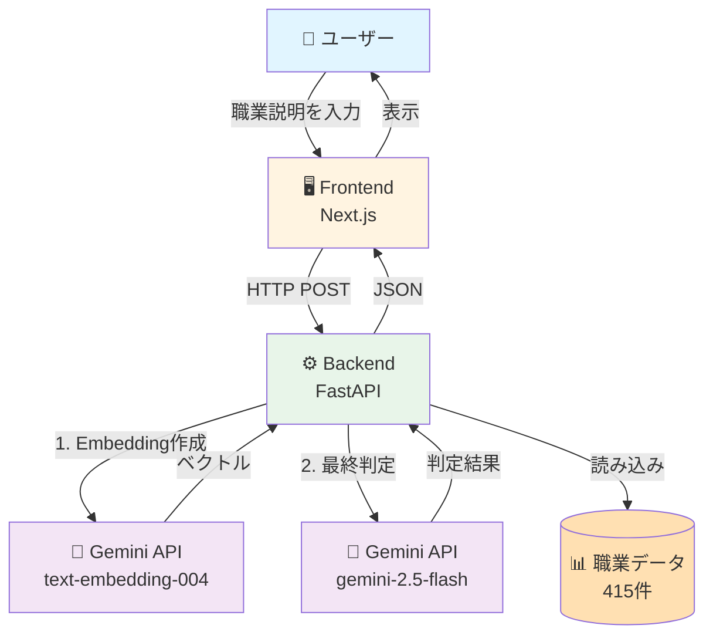
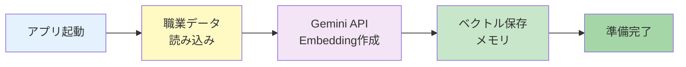
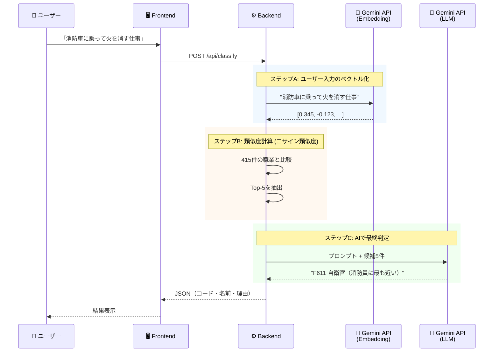

# 職業分類判定システムの仕組み - 完全ガイド

## 🎯 このシステムは何をするのか？

ユーザーが**自由な文章**で職業を説明すると、システムが**最も適切な職業分類コード**を自動で判定します。

**例:**
```
入力: 「消防車に乗って火を消す仕事」
↓
出力: 職業コード「F611」保安職業従事者（消防員）
```

---

## 🏗️ システム全体像



---

## 📚 RAG（Retrieval-Augmented Generation）の仕組み

このシステムは**RAG**という手法を使っています。

### RAGとは？

**R**etrieval（検索） + **A**ugmented（拡張） + **G**eneration（生成）

1. **Retrieval（検索）**: データベースから関連情報を検索
2. **Augmented（拡張）**: 検索結果でAIのコンテキストを拡張
3. **Generation（生成）**: 拡張されたコンテキストで回答生成

### なぜRAGが必要？

❌ **AIに直接質問した場合の問題:**
- AIは**訓練データに含まれない**最新情報を知らない
- 企業固有のデータや専門分類を理解していない
- 「日本標準職業分類」の正確なコードを知らない

✅ **RAGを使うと:**
- **最新の職業分類データ**を参照できる
- **正確なコード**を返せる
- **データの更新**が簡単（AIの再訓練不要）

---

## 🔄 処理フローの詳細

### ステップ1️⃣: 起動時の準備（アプリ起動時に1回だけ）



**詳細:**

1. **職業データ読み込み** (`occupation.csv`)
   ```csv
   code,name,description
   F611,自衛官,"自衛官。陸上・海上・航空自衛隊の隊員として..."
   F612,警察官,"警察官。治安維持、犯罪の予防・捜査..."
   ```
   → **415件**の職業データ

2. **Embedding（ベクトル化）**
   
   各職業の説明文を**768次元のベクトル**に変換：
   ```python
   # 例: "警察官。治安維持、犯罪の予防・捜査..."
   → [0.123, -0.456, 0.789, ..., 0.234]  # 768個の数値
   ```
   
   **なぜベクトル化？**
   - 意味の類似性を**数学的に計算**できる
   - 高速な検索が可能

3. **メモリに保存**
   - 415件 × 768次元 = 約2.5MBのデータ
   - 毎回API呼び出し不要（高速化）

---

### ステップ2️⃣: ユーザーリクエスト処理



---

## 🔍 ステップA: ユーザー入力のベクトル化

**入力:** `"消防車に乗って火を消す仕事"`

**処理:**
```python
# Gemini Embedding API呼び出し
embedding = genai.embed_content(
    model="models/text-embedding-004",
    content=user_input
)

# 結果: 768次元ベクトル
user_vector = [0.345, -0.123, 0.678, ..., 0.901]  # 768個
```

**なぜEmbeddingが重要？**

❌ **キーワードマッチングの問題:**
```
入力: "消防車に乗って火を消す仕事"
職業データ: "消防員。火災の消火、救助活動..."

→ "消防車"というワードは職業データにない
→ マッチング失敗
```

✅ **Embeddingの利点:**
```
入力ベクトル:    [0.345, -0.123, 0.678, ...]
消防員ベクトル:  [0.340, -0.120, 0.680, ...]
                  ↑ ほぼ同じ方向を向いている

→ 意味的に類似していると判定！
```

---

## 📐 ステップB: コサイン類似度で候補抽出

### コサイン類似度とは？

2つのベクトルの**方向の近さ**を測定する指標（-1 〜 1）

```
1.0  = 完全に同じ方向（最も類似）
0.0  = 直角（無関係）
-1.0 = 正反対の方向
```

**視覚的イメージ:**

```
        ベクトルA (入力)
           ↗
          /
         / θ (角度が小さい = 類似)
        /
       ↗ ベクトルB (職業データ)

コサイン類似度 = cos(θ)
```

**計算:**
```python
from sklearn.metrics.pairwise import cosine_similarity

# ユーザー入力と全職業データの類似度を計算
similarities = cosine_similarity(
    user_vector.reshape(1, -1),  # (1, 768)
    all_job_vectors              # (415, 768)
)

# 結果: [0.85, 0.72, 0.68, 0.65, 0.61, ...]
#       ↑最も類似   ↑上位5件を抽出
```

**Top-5候補の例:**
```
1. [F611] 自衛官         (類似度: 0.85)
2. [F612] 警察官         (類似度: 0.72)
3. [F613] 海上保安官     (類似度: 0.68)
4. [F62]  その他の保安   (類似度: 0.65)
5. [I42]  自動車運転従事者 (類似度: 0.61)
```

---

## 🤖 ステップC: Gemini LLMで最終判定

### なぜLLMが必要？

類似度検索だけでは不十分な場合があります：

**問題例:**
```
入力: "消防車に乗って火を消す仕事"

候補:
1. 自衛官     (類似度: 0.85) ← 高いが不正確
2. 警察官     (類似度: 0.72)
3. 消防員     (類似度: 0.70) ← 正解だが3位
```

→ **LLMが文脈を理解して正しく判定**

### プロンプト構築

```python
prompt = f"""
あなたは職業分類の専門家です。

【ユーザーの入力】
{user_input}

【候補職業】（類似度順）
1. コード: F611
   名称: 自衛官
   説明: 陸上・海上・航空自衛隊の隊員として、国の防衛...
   
2. コード: F612
   名称: 警察官
   説明: 治安維持、犯罪の予防・捜査...
   
3. コード: F613
   名称: 消防員
   説明: 火災の消火、救助活動、防災活動...

【タスク】
最も適切な職業を1つ選び、以下のJSON形式で返してください：

{{
  "code": "選んだ職業のコード",
  "reason": "選んだ理由"
}}
"""
```

### Gemini APIの応答

```python
response = model.generate_content(prompt)

# Geminiの判断:
{
  "code": "F613",
  "reason": "「消防車に乗って火を消す」という説明から、
            消防員の主要業務である消火活動を示している。
            自衛官や警察官も緊急車両を使用するが、
            火災対応は消防員の専門業務である。"
}
```

---

## 💾 データ構造

### 職業データ（CSVファイル）

**ダミーデータ（before）:**
```csv
code,name,description
12,情報処理・通信技術者,プログラマー、SE、コーディング...
41,販売従事者,小売店員、営業職、接客...
```
→ **16件のみ**

**実データ（after - e-Statから取得）:**
```csv
code,name,description
A,管理的職業従事者,事業経営方針の決定・経営方針に基づく...
01,管理的公務員,国又は地方公共団体における課以上の...
011,議会議員,国会又は地方議会の議員として...
F611,自衛官,陸上・海上・航空自衛隊の隊員として...
F612,警察官,治安維持、犯罪の予防・捜査...
F613,消防員,火災の消火、救助活動、防災活動...
```
→ **415件**（日本標準職業分類 平成21年版）

### コード体系

```
A          大分類（管理的職業従事者）
├─ 01      中分類（管理的公務員）
│  ├─ 011  小分類（議会議員）
│  ├─ 012  小分類（管理的国家公務員）
│  └─ 013  小分類（管理的地方公務員）
├─ 02      中分類（法人・団体役員）
...

F          大分類（保安職業従事者）
├─ F61     中分類（自衛官・警察官等）
│  ├─ F611 小分類（自衛官）
│  ├─ F612 小分類（警察官）
│  └─ F613 小分類（消防員）
```

---

## 🔌 Gemini API統合

### 使用しているAPI

**1. Embedding API (`text-embedding-004`)**
```python
response = genai.embed_content(
    model="models/text-embedding-004",
    content=text
)

# 戻り値: 768次元ベクトル
embedding = response['embedding']  # [0.123, -0.456, ...]
```

**用途:**
- ユーザー入力のベクトル化
- 職業データのベクトル化（起動時）

**2. Generative API (`gemini-2.5-flash`)**
```python
response = model.generate_content(prompt)

# 戻り値: テキスト（JSON形式）
result = json.loads(response.text)
```

**用途:**
- 候補から最終判定
- 判定理由の生成

### クォータ制限

**無料枠（現状）:**
```
gemini-2.5-flash: 20 requests/day
text-embedding-004: クォータ比較的緩い
```

**1回の職業分類で消費:**
- Embedding API: 1回（ユーザー入力）
- Generative API: 1回（最終判定）

**合計:** 2回/リクエスト

→ **1日最大10職業まで分類可能**（無料枠）

---

## 🚀 Kubernetes デプロイメント

### アーキテクチャ

```
┌─────────────────────────────────────┐
│  Internet (ユーザー)                │
└────────────┬────────────────────────┘
             │
             ▼
┌─────────────────────────────────────┐
│  Frontend LoadBalancer               │
│  10.0.20.95:3000                     │
└────────────┬────────────────────────┘
             │
    ┌────────┴────────┐
    ▼                 ▼
┌─────────┐      ┌─────────┐
│Frontend │      │Frontend │  
│Pod 1    │      │Pod 2    │  (Replicas: 2)
└─────────┘      └─────────┘
    │                 │
    └────────┬────────┘
             ▼
┌─────────────────────────────────────┐
│  Backend LoadBalancer                │
│  10.0.20.96:8000                     │
└────────────┬────────────────────────┘
             │
    ┌────────┴────────┐
    ▼                 ▼
┌─────────┐      ┌─────────┐
│Backend  │      │Backend  │  (Replicas: 2)
│Pod 1    │      │Pod 2    │
│         │      │         │
│ ┌─────┐ │      │ ┌─────┐ │
│ │CSV  │ │      │ │CSV  │ │  職業データ
│ │415件│ │      │ │415件│ │
│ └─────┘ │      │ └─────┘ │
└─────────┘      └─────────┘
    │                 │
    └────────┬────────┘
             ▼
    ┌──────────────────┐
    │  Kubernetes Secret│
    │  gemini-api-key   │
    └──────────────────┘
             │
             ▼
    ┌──────────────────┐
    │  Gemini API       │
    │  (Google Cloud)   │
    └──────────────────┘
```

### データフロー

**1. ユーザーがブラウザでアクセス:**
```
http://10.0.20.95:3000
  ↓
Frontend LoadBalancer
  ↓
Frontend Pod (Next.js)
  ↓
HTML/CSS/JavaScriptをブラウザに送信
```

**2. ユーザーが職業を入力:**
```
ブラウザ
  ↓ (fetch API)
POST http://10.0.20.96:8000/api/classify
  ↓
Backend LoadBalancer
  ↓
Backend Pod (FastAPI)
  ↓
Classifier (RAG処理)
  ├─ Embedding API呼び出し
  ├─ コサイン類似度計算
  └─ LLM API呼び出し
  ↓
JSON レスポンス
  ↓
ブラウザに表示
```

---

## 📊 パフォーマンス最適化

### 1. Embeddingsのキャッシング

❌ **毎回APIを呼ぶ場合:**
```
リクエストごと:
- 415件の職業データをEmbedding
- 415回のAPI呼び出し
- 約10秒の遅延
```

✅ **起動時キャッシング:**
```
アプリ起動時:
- 415件を一度だけEmbedding
- メモリに保存

リクエスト時:
- メモリから読み込み（瞬時）
- ユーザー入力のみAPI呼び出し（1回）
```

### 2. ベクトル計算の高速化

**scikit-learn使用:**
```python
# NumPy配列での一括計算
similarities = cosine_similarity(
    user_vec,      # (1, 768)
    all_job_vecs   # (415, 768)
)
# → 0.01秒以下で完了
```

### 3. Kubernetes レプリカ

```yaml
replicas: 2  # Frontend & Backend各2台
```

**利点:**
- 負荷分散
- 高可用性（1台障害でも継続）
- ローリングアップデート可能

---

## 🔒 セキュリティ

### API Key管理

**❌ 悪い例:**
```python
# コードにハードコード
GEMINI_API_KEY = "AIzaSyD..."  # 危険！
```

**✅ 良い例:**
```yaml
# Kubernetes Secret
apiVersion: v1
kind: Secret
metadata:
  name: gemini-secret
data:
  api-key: <base64-encoded-key>
```

```python
# 環境変数から読み込み
api_key = os.getenv("GEMINI_API_KEY")
```

### Pod Security

```yaml
securityContext:
  runAsNonRoot: true          # 非rootユーザーで実行
  runAsUser: 1000
  allowPrivilegeEscalation: false  # 権限昇格防止
  capabilities:
    drop: [ALL]               # 不要な権限削除
```

---

## 🎓 まとめ

### このシステムの特徴

1. **RAGアーキテクチャ**
   - 検索 + AI判定の組み合わせ
   - 高精度な分類が可能

2. **Gemini API活用**
   - Embedding: 意味的類似性の計算
   - LLM: 文脈理解と最終判定

3. **実データ統合**
   - 415件の公式職業分類
   - 日本標準職業分類（平成21年版）

4. **Kubernetes運用**
   - スケーラブル（レプリカ2台）
   - LoadBalancer で外部公開
   - セキュアな設定

### 技術スタック

```
Frontend:  Next.js 15 + React + TypeScript
Backend:   FastAPI + Python 3.11
AI:        Google Gemini API
Data:      e-Stat (政府統計)
Infra:     Kubernetes + LoadBalancer
CI/CD:     GitHub Actions
```

### データフロー（まとめ）

```
ユーザー入力
  ↓
[1] Embedding化（768次元ベクトル）
  ↓
[2] 類似度計算（コサイン類似度）
  ↓
[3] Top-5候補抽出
  ↓
[4] Gemini LLMで最終判定
  ↓
結果表示（コード・名称・理由）
```

---

## 💡 今後の拡張案

1. **データ更新の自動化**
   - e-Stat APIからの定期取得
   - キャッシュの自動更新

2. **精度向上**
   - より多くの候補を考慮
   - ファインチューニング

3. **多言語対応**
   - 英語での職業説明
   - 多言語Embedding

4. **ユーザーフィードバック**
   - 判定結果の評価機能
   - フィードバックによる学習

5. **GitOps導入**
   - ArgoCD/Flux
   - 自動デプロイメント

---

このシステムは、**AI（Gemini）の理解力**と**構造化データ（職業分類）の正確性**を組み合わせることで、自由な文章から正確な職業コードを判定できる実用的なアプリケーションです。
